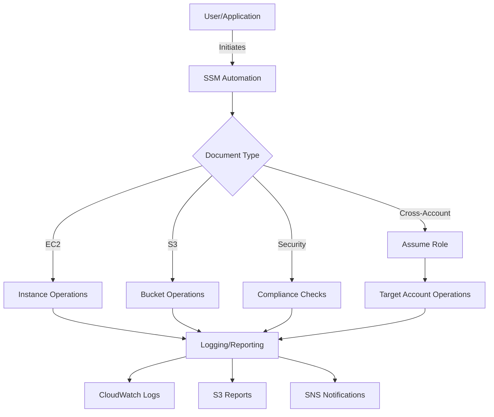

# AWS SSM Automation Scripts

[](https://github.com/thomasvincent/aws-ssm-automation-scripts/actions/workflows/validate.yml)
[](https://github.com/thomasvincent/aws-ssm-automation-scripts/actions/workflows/security-scan.yml)
[](https://opensource.org/licenses/MIT)
[](https://github.com/thomasvincent/aws-ssm-automation-scripts/releases)
[](https://github.com/thomasvincent/aws-ssm-automation-scripts/graphs/commit-activity)

A comprehensive collection of production-ready AWS Systems Manager (SSM) Automation documents for streamlining AWS operations, security compliance, and cost optimization.

## 🚀 Overview

This repository provides battle-tested SSM Automation documents that help DevOps teams, system administrators, and cloud engineers automate common AWS management tasks. All scripts follow AWS best practices and are designed to be idempotent, secure, and easily customizable.

### Key Benefits

- **🔄 Automation First**: Reduce manual operations and human error
- **🔒 Security by Default**: Built-in security best practices and compliance checks
- **💰 Cost Optimization**: Identify and remediate cost inefficiencies
- **🌍 Multi-Account Support**: Manage resources across multiple AWS accounts
- **📊 Comprehensive Logging**: Detailed execution logs and audit trails
- **🧩 Modular Design**: Reusable components and shared libraries

## 📚 Table of Contents

- [Quick Start](#-quick-start)
- [Available Automation Scripts](#-available-automation-scripts)
- [Installation](#-installation)
- [Usage Examples](#-usage-examples)
- [Architecture](#-architecture)
- [Best Practices](#-best-practices)
- [Development](#-development)
- [Contributing](#-contributing)
- [Support](#-support)

## 🎯 Quick Start

```bash
# 1. Clone the repository
git clone https://github.com/thomasvincent/aws-ssm-automation-scripts.git

# 2. Register an SSM document
aws ssm create-document \
  --name "EnableS3Encryption" \
  --document-type "Automation" \
  --content file://s3_encryption.yaml

# 3. Execute the automation
aws ssm start-automation-execution \
  --document-name "EnableS3Encryption" \
  --parameters '{"BucketName":["my-bucket"],"KMSMasterKey":["arn:aws:kms:us-east-1:123456789012:key/12345678-1234-1234-1234-123456789012"]}'
```

## 📦 Available Automation Scripts

### CDN & Content Delivery

#### 📡 CloudFront Distribution Management
**File**: `cloudfront_distribution_management.yaml`

Comprehensive CloudFront distribution lifecycle management including creation, updates, invalidations, and security configuration.

**Key Features**:
- Create and configure new distributions
- Update existing distribution settings
- Perform cache invalidations
- Configure security policies and geo-restrictions
- Manage custom headers and behaviors

<details>
<summary>View Parameters</summary>

- `Operation`: The operation to perform (Create, Update, Invalidate, UpdateSecurityConfig)
- `DistributionId`: ID of existing distribution (required for updates)
- `OriginDomainName`: Origin domain name (required for creation)
- `PriceClass`: CloudFront price class
- `ViewerCertificateConfig`: SSL/TLS certificate configuration
- `GeoRestriction`: Geographic access restrictions
- [See full parameter list in script]

</details>

### Compute & Instance Management

#### 🖥️ EC2 Instance Patching
**File**: `ec2_instance_patching.yaml`

Automated patching solution for EC2 instances with configurable reboot options and severity filters.

**Key Features**:
- Selective patching based on severity levels
- Optional automatic reboot after patching
- Parallel patching support
- Detailed patch compliance reporting

<details>
<summary>View Parameters</summary>

- `InstanceIds`: List of EC2 instance IDs to patch
- `RebootOption`: Whether to reboot after patching (NoReboot, RebootIfNeeded)
- `PatchSeverity`: Minimum severity level (Critical, Important, Medium, Low)
- `AutomationAssumeRole`: IAM role for automation execution

</details>

### Security & Compliance

#### 🔐 Security Group Audit
**File**: `security_group_audit.yaml`

Comprehensive security group auditing and automated remediation for compliance.

**Key Features**:
- Identify overly permissive rules (0.0.0.0/0)
- Automatic remediation of high-risk ports
- Compliance reporting
- Exclusion list support
- VPC-specific auditing

<details>
<summary>View Parameters</summary>

- `SecurityGroupIds`: Specific security groups to audit (optional)
- `VpcIds`: VPCs to audit (optional)
- `RemediationMode`: Audit or Remediate
- `RemediateOpenPorts`: Ports to close if open to internet
- `ExcludedSecurityGroups`: Security groups to exclude

</details>

#### 🔑 S3 Bucket Encryption
**File**: `s3_encryption.yaml`

Enable KMS encryption on S3 buckets with verification.

**Key Features**:
- Apply KMS encryption to existing buckets
- Verify encryption status
- Support for customer-managed KMS keys
- Bucket existence validation

### Cost Optimization

#### 💰 Cost Optimization Recommendations
**File**: `cost_optimization_recommendations.yaml`

Identify and report cost optimization opportunities across your AWS infrastructure.

**Key Features**:
- Identify idle and underutilized resources
- Generate detailed HTML reports
- SNS notifications for findings
- Multi-resource type analysis (EC2, EBS, RDS, etc.)
- Customizable utilization thresholds

<details>
<summary>View Parameters</summary>

- `ResourceTypes`: Resources to analyze (EC2, EBS, S3, RDS)
- `IdleDaysThreshold`: Days of inactivity to consider idle
- `LowUtilizationThreshold`: CPU threshold for underutilization
- `GenerateReport`: Generate HTML report
- `ReportS3Bucket`: S3 bucket for reports

</details>

#### 💰 Cost Savings Remediation
**File**: `cost_savings_remediation.yaml`

Safely remediate common sources of AWS cost waste with tag-aware targeting and DryRun-first execution.

**Key Features**:
- Stop EC2 instances with consistently low CPU utilization
- Delete unattached EBS volumes (optional pre-delete snapshot)
- Release unused Elastic IPs
- Delete idle ALB/NLB with no traffic and no registered targets
- Stop non–Multi-AZ RDS DB instances with low CPU
- Global DryRun control and SNS summary notification

<details>
<summary>View Parameters</summary>

- `Actions`: Operations to perform (StopIdleEC2, DeleteUnattachedEBS, ReleaseUnusedEIPs, CleanupIdleELB, StopIdleRDS)
- `TargetTags`: Tag key/value map resources must match (e.g., `{Environment: Development}`)
- `IdleDaysThreshold`: Window to evaluate idleness (default 30)
- `LowUtilizationThreshold`: CPU percentage threshold for underutilization (default 10)
- `SnapshotBeforeDelete`: For EBS, create a snapshot before deletion (default true)
- `DryRun`: Report-only mode (default true)
- `NotificationTopicArn`: Optional SNS topic for a summary notification

</details>

**Usage**

```bash
aws ssm start-automation-execution \
  --document-name "CostSavingsRemediation" \
  --parameters '{
    "Actions":["StopIdleEC2","DeleteUnattachedEBS","ReleaseUnusedEIPs","CleanupIdleELB","StopIdleRDS"],
    "TargetTags":{"Environment":"Development"},
    "IdleDaysThreshold":["30"],
    "LowUtilizationThreshold":["10"],
    "SnapshotBeforeDelete":["true"],
    "DryRun":["true"]
  }'
```

### IAM & Access Management

#### 👤 Attach Policies to Role
**File**: `attach_policies_to_role.yaml`

Streamline IAM role configuration by attaching multiple policies.

**Key Features**:
- Attach AWS managed policies
- Attach customer managed policies
- Bulk policy attachment
- Validation and error handling

### Lambda Functions

#### ⚡ Lambda Function Management
**File**: `lambda_function_management.yaml`

Complete Lambda function lifecycle management.

**Key Features**:
- Create new functions from S3 packages
- Update function code and configuration
- Manage aliases and versions
- Configure environment variables
- Set reserved concurrent executions

<details>
<summary>View Parameters</summary>

- `Operation`: Operation type (Create, Update, Delete, AddAlias)
- `FunctionName`: Lambda function name
- `S3Bucket`: Deployment package bucket
- `S3Key`: Deployment package key
- `Handler`: Function handler
- `Runtime`: Lambda runtime
- `MemorySize`: Memory allocation (MB)
- `Timeout`: Execution timeout (seconds)

</details>

### Maintenance & Operations

#### 🔧 Maintenance Window Setup
**File**: `maintenance_window_setup.yaml`

Create and configure SSM Maintenance Windows for scheduled operations.

**Key Features**:
- Flexible scheduling with cron expressions
- Target registration (instances or tags)
- Task configuration
- Service role management

### Multi-Account Management

#### 🌐 Cross-Account Resource Management
**File**: `cross_account_resource_management.yaml`

Manage resources across multiple AWS accounts from a central location.

**Key Features**:
- Assume role across accounts
- Parallel account processing
- Multi-region support
- Comprehensive error handling
- SNS notifications

<details>
<summary>View Parameters</summary>

- `Operation`: Cross-account operation type
- `TargetAccounts`: List of AWS account IDs
- `TargetRegions`: AWS regions to target
- `CrossAccountRoleName`: Role name to assume
- `MaxConcurrentAccounts`: Parallel execution limit

</details>

### Resource Management

#### 🏗️ Create and Tag Resources
**File**: `create_and_tag_resources.yaml`

Standardized resource creation with consistent tagging strategy.

**Key Features**:
- Support multiple resource types
- Enforce tagging standards
- Cost center allocation
- Environment classification
- Department and project tracking

## 🛠️ Shared Python Modules

The repository includes reusable Python modules in `shared/python/`:

### aws_helpers.py
- General AWS utility functions
- Logging configuration
- Tag creation and management
- Parameter validation
- Error handling utilities

### config_manager.py
- Configuration from SSM Parameter Store
- S3-based configuration management
- Environment-specific settings
- Dynamic configuration updates

### security_helpers.py
- Security group analysis
- Encryption status checks
- Compliance validation
- Security best practices enforcement

## 📥 Installation

### Method 1: Direct AWS Registration

```bash
# Register all documents at once
for file in *.yaml; do
  name=$(basename "$file" .yaml)
  aws ssm create-document \
    --name "$name" \
    --document-type "Automation" \
    --content "file://$file"
done
```

### Method 2: Using AWS CloudFormation

```yaml
Resources:
  S3EncryptionDocument:
    Type: AWS::SSM::Document
    Properties:
      Name: EnableS3Encryption
      DocumentType: Automation
      Content: !Sub |
        ${file(s3_encryption.yaml)}
```

### Method 3: Terraform

```hcl
resource "aws_ssm_document" "s3_encryption" {
  name          = "EnableS3Encryption"
  document_type = "Automation"
  content       = file("${path.module}/s3_encryption.yaml")
}
```

## 📖 Usage Examples

### Example 1: Enable S3 Bucket Encryption

```bash
aws ssm start-automation-execution \
  --document-name "s3_encryption" \
  --parameters '{
    "BucketName": ["my-data-bucket"],
    "KMSMasterKey": ["arn:aws:kms:us-east-1:123456789012:key/12345678-1234-1234-1234-123456789012"]
  }'
```

### Example 2: Patch EC2 Instances

```bash
aws ssm start-automation-execution \
  --document-name "ec2_instance_patching" \
  --parameters '{
    "InstanceIds": ["i-1234567890abcdef0", "i-0987654321fedcba0"],
    "RebootOption": ["RebootIfNeeded"],
    "PatchSeverity": ["Critical"]
  }'
```

### Example 3: Audit Security Groups

```bash
aws ssm start-automation-execution \
  --document-name "security_group_audit" \
  --parameters '{
    "RemediationMode": ["Audit"],
    "RemediateOpenPorts": ["22", "3389", "3306"],
    "VpcIds": ["vpc-12345678"]
  }'
```

### Example 4: Cross-Account Operations

```bash
aws ssm start-automation-execution \
  --document-name "cross_account_resource_management" \
  --parameters '{
    "Operation": ["TagResources"],
    "TargetAccounts": ["111111111111", "222222222222"],
    "CrossAccountRoleName": ["SSMCrossAccountRole"],
    "TagKey": ["Environment"],
    "TagValue": ["Production"]
  }'
```

## 🏗️ Architecture

### Document Structure

```
aws-ssm-automation-scripts/
├── *.yaml                    # SSM Automation documents
├── shared/                   # Shared modules
│   └── python/              # Python helper modules
│       ├── aws_helpers.py
│       ├── config_manager.py
│       └── security_helpers.py
├── .github/                 # GitHub Actions workflows
│   └── workflows/
│       ├── validate.yml     # Document validation
│       ├── security-scan.yml # Security scanning
│       └── release.yml      # Automated releases
└── tests/                   # Test scripts (if applicable)
```

### Execution Flow



## ✅ Best Practices

### 1. IAM Permissions

Always use least privilege principles:

```json
{
  "Version": "2012-10-17",
  "Statement": [
    {
      "Effect": "Allow",
      "Action": [
        "ssm:StartAutomationExecution",
        "ssm:GetAutomationExecution"
      ],
      "Resource": "*"
    },
    {
      "Effect": "Allow",
      "Action": "iam:PassRole",
      "Resource": "arn:aws:iam::*:role/SSMAutomationRole"
    }
  ]
}
```

### 2. Error Handling

All documents include proper error handling:
- `onFailure` actions (Abort, Continue)
- Retry logic where appropriate
- Detailed error logging

### 3. Tagging Strategy

Implement consistent tagging:
```yaml
Tags:
  Environment: Production
  Department: DevOps
  Project: Infrastructure
  Owner: team@example.com
  CostCenter: CC-12345
```

### 4. Testing

Test in non-production first:
1. Use sandbox/development accounts
2. Target test resources
3. Review execution logs
4. Validate results

## 🔧 Development

### Creating New Documents

1. Use the template structure:
```yaml
---
description: Clear description of what this document does
schemaVersion: '0.3'
assumeRole: '{{ AutomationAssumeRole }}'
parameters:
  # Define all parameters
mainSteps:
  # Define automation steps
```

2. Follow naming conventions:
   - Use snake_case for file names
   - Use PascalCase for parameters
   - Use camelCase for step names

3. Include comprehensive documentation

### Testing Locally

```bash
# Validate YAML syntax
python -c "import yaml; yaml.safe_load(open('document.yaml'))"

# Test with dry-run (if supported)
aws ssm start-automation-execution \
  --document-name "TestDocument" \
  --parameters '{"DryRun":["true"]}'
```

## 🤝 Contributing

We welcome contributions! Please see our [Contributing Guide](CONTRIBUTING.md) for details.

### How to Contribute

1. Fork the repository
2. Create a feature branch (`git checkout -b feature/amazing-automation`)
3. Commit your changes (`git commit -m 'Add amazing automation'`)
4. Push to the branch (`git push origin feature/amazing-automation`)
5. Open a Pull Request

### Contribution Guidelines

- Follow existing document structure
- Include comprehensive parameter descriptions
- Add usage examples to README
- Ensure all YAML is valid
- Test thoroughly before submitting

## 🔄 CI/CD Pipeline

### Automated Workflows

- **Validation**: All YAML documents are validated on push
- **Security Scanning**: CodeQL scans for security issues
- **Automated Testing**: Integration tests in sandbox environment
- **Release Management**: Semantic versioning with automated releases
- **Dependency Updates**: Dependabot keeps dependencies current

### Release Process

Releases follow semantic versioning (MAJOR.MINOR.PATCH):

- **MAJOR**: Breaking changes to document parameters
- **MINOR**: New documents or features
- **PATCH**: Bug fixes and minor improvements

## 📊 Monitoring & Logging

### CloudWatch Integration

All executions are logged to CloudWatch:
```
/aws/ssm/automation/{document-name}/{execution-id}
```

### Metrics to Monitor

- Execution success/failure rates
- Average execution duration
- Resource modification counts
- Cost optimization savings

## 🆘 Support

### Documentation
- [AWS SSM Documentation](https://docs.aws.amazon.com/systems-manager/)
- [Automation Document Reference](https://docs.aws.amazon.com/systems-manager/latest/userguide/automation-documents.html)

### Getting Help
- **Issues**: [GitHub Issues](https://github.com/thomasvincent/aws-ssm-automation-scripts/issues)
- **Discussions**: [GitHub Discussions](https://github.com/thomasvincent/aws-ssm-automation-scripts/discussions)
- **Security Issues**: See [SECURITY.md](SECURITY.md)

## 📄 License

This project is licensed under the MIT License - see the [LICENSE](LICENSE) file for details.

## 👏 Acknowledgments

- AWS Systems Manager team for the automation framework
- Contributors and users of these scripts
- Open source community for inspiration and best practices

## 🗺️ Roadmap

- [ ] AWS Organizations integration
- [ ] Cost optimization automation workflows
- [ ] Disaster recovery automation
- [ ] Compliance reporting dashboards
- [ ] Integration with AWS Config rules
- [ ] Slack/Teams notifications
- [ ] Terraform module wrapper
- [ ] Enhanced cross-region support

---

**Made with ❤️ by the DevOps community**

For commercial support or custom automation development, please contact [Thomas Vincent](https://github.com/thomasvincent).
